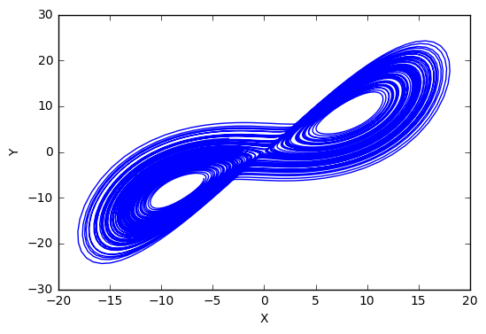
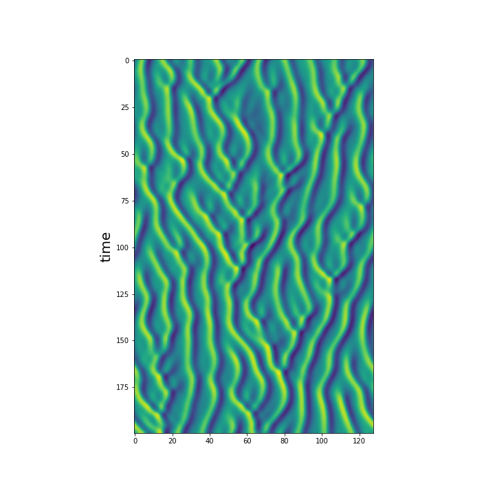

Equation of Motions
====================

`eom` crate is a configurable ODE/PDE solver

Contents
---------
- Algorithms
  - explicit schemes
    - Euler
    - Heun
    - classical 4th order Runge-Kutta
  - semi-implicit schemes
    - stiff RK4
- ODE
  - [Lorenz three-variables system](https://en.wikipedia.org/wiki/Lorenz_system)
  - [Lorenz 96 system](https://en.wikipedia.org/wiki/Lorenz_96_model)
  - [Roessler system](https://en.wikipedia.org/wiki/R%C3%B6ssler_attractor)
  - GOY shell model
    - [notebook](GOY.ipynb)
- PDE
  - Kuramoto-Sivashinsky equation
    - [notebook](KSE.ipynb)

Lyapunov analysis
-----------------
- [Lyapunov expoents of Lorenz 63 model](http://sprott.physics.wisc.edu/chaos/lorenzle.htm)
  - [example](examples/lyapunov.rs)
- [Covarient Lyapunov vector (CLV)](https://arxiv.org/abs/1212.3961)
  - [example](examples/clv.rs) 
  - [notebook](CLV.ipynb)

Gallery
--------

### Lorenz '63 model

### Kuramoto-Sivashinsky equation

License
-------
MIT-License, see [LICENSE](LICENSE) file.
