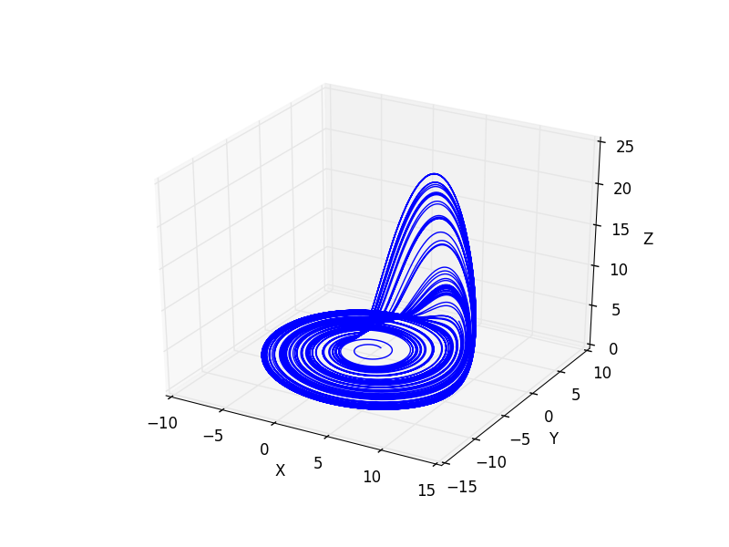

ndarray-odeint [](https://crates.io/crates/ndarray-odeint) [](https://docs.rs/ndarray-odeint) [](https://travis-ci.org/termoshtt/ndarray-odeint)
===============

solve ODE with rust-ndarray

Example
--------

```rust
use ndarray::rcarr1;
use itertools::iterate;
use ndarray_odeint::prelude::*;

let dt = 0.01;
let eom = Lorenz63::default();
let teo = explicit::rk4(eom, dt);
let ts = iterate(rcarr1(&[1.0, 0.0, 0.0]), |y| teo.iterate(y.clone()));
let end_time = 10000;
for v in ts.take(end_time) {
  println!("{:?}", &v);
}
```




This figure is plotted by matplotlib (see [plot script](figure.py)).

Developement status
--------------------

See issues

- [x] [Explicit Schemes](/../../issues/2)
- [ ] [Implicit Schemes](/../../issues/3)

License
-------
MIT-License, see [LICENSE](LICENSE) file.
